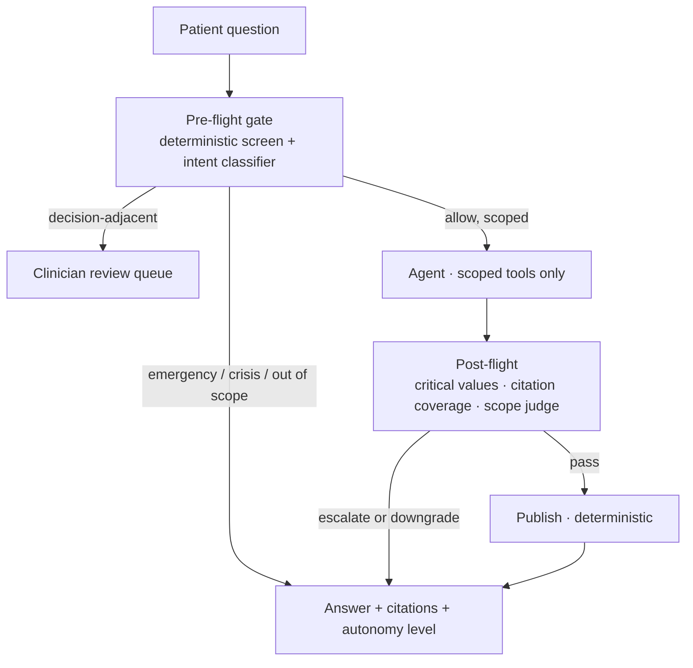

# Clinical Care Navigator

**A patient-facing clinical assistant that is allowed to say "I won't answer that" —
and whose refusal is enforced by the architecture, measured in production, and
tunable by the clinical owner rather than the vendor.**

> Architectural demonstration on fully synthetic [Synthea](https://github.com/synthetichealth/synthea)
> data. **Not a medical device. Does not diagnose. Not a substitute for care.**
> Not a screener, a triage tool, or a symptom checker.

---

## The problem

A patient reads their own portal record and does not understand it. *"My A1c came
back 7.8 — what does that mean?"* An assistant that answers is useful. An
assistant that answers **everything** is a liability: the same interface receives
*"should I stop taking my metformin?"*, *"do I have lupus?"*, and *"I have
crushing chest pain."*

Most healthcare AI demos put a disclaimer in the system prompt and call it
safety. This one makes the guardrail a node in the graph, with its own tests and
its own published numbers.

## The pattern: a guardrail sandwich with two independent halves

Policy runs **before** the model and **after** it — and the second half is not a
replay of the first. It assesses the *retrieved evidence* and the *drafted
answer* on its own authority.

That distinction is the whole app. *"What does my potassium of 6.9 mean?"* is a
benign education question, so the pre-flight gate allows it. The retrieved value
is a medical emergency, and only the post-flight half can know that.



## Status

**Phase 0 — template transplant.** Walking skeleton only. See
`docs/PLAN.md` for the full build plan and
`docs/PLAN.md` §7 for phase-by-phase exit criteria.

| Phase | State |
|---|---|
| 0 · Template transplant | in progress |
| 1 · Data foundation | not started |
| 2 · Tools and scoping | not started |
| 3 · Pre-flight gate | not started |
| 4 · Agent core and draft | not started |
| 5 · Post-flight ★ | not started |
| 6 · API, persistence, observability | not started |
| 7 · Frontend | not started |
| 8 · Evals | not started |
| 9 · Docs, credibility, launch | not started |

## Run it

```bash
uv sync --extra dev
cp .env.example .env      # add NAVIGATOR_OPENAI_API_KEY
make data                 # build the synthetic record + education stores
make dev                  # http://localhost:8000/healthz
make check                # ruff, mypy --strict, import-linter, pytest
```

## Licence and provenance

See [`NOTICE.md`](NOTICE.md). Independent implementation; synthetic data only;
education citations are real public-domain NLM sources.
