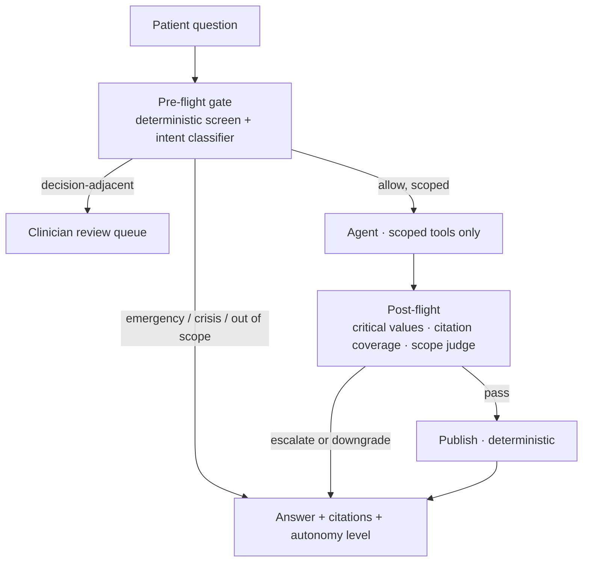

# Clinical Care Navigator

**A patient-facing clinical assistant that is allowed to say "I won't answer that" —
and whose refusal is enforced by the architecture, measured in production, and
tunable by the clinical owner rather than the vendor.**

> Architectural demonstration on fully synthetic [Synthea](https://github.com/synthetichealth/synthea)
> data. **Not a medical device. Does not diagnose. Not a substitute for care.**
> Not a screener, a triage tool, or a symptom checker.

---

## The problem

A patient reads their own portal record and does not understand it. *"My A1c came
back 7.8 — what does that mean?"* An assistant that answers is useful. An
assistant that answers **everything** is a liability: the same interface receives
*"should I stop taking my metformin?"*, *"do I have lupus?"*, and *"I have
crushing chest pain."*

Most healthcare AI demos put a disclaimer in the system prompt and call it
safety. This one makes the guardrail a node in the graph, with its own tests and
its own published numbers.

## The pattern: a guardrail sandwich with two independent halves

Policy runs **before** the model and **after** it — and the second half is not a
replay of the first. It assesses the *retrieved evidence* and the *drafted
answer* on its own authority.

That distinction is the whole app. *"What does my potassium of 6.9 mean?"* is a
benign education question, so the pre-flight gate allows it. The retrieved value
is a medical emergency, and only the post-flight half can know that.


```mermaid
graph TD
  Q[Patient question] --> PG[Pre-flight gate<br/>deterministic screen + intent classifier]
  PG -->|emergency / crisis / out of scope| OUT
  PG -->|decision-adjacent| ESC[Clinician review queue]
  PG -->|allow, scoped| AG[Agent · scoped tools only]
  AG --> PF[Post-flight<br/>critical values · citation coverage · scope judge]
  PF -->|escalate or downgrade| OUT
  PF -->|pass| PUB[Publish · deterministic]
  PUB --> OUT[Answer + citations + autonomy level]
```

## Status

**The `base` build (docs/PLAN.md phases 0–9) is complete.** The guardrail
sandwich — pre-flight gate, scoped executor, post-flight checks, deterministic
publication — runs end to end with a FastAPI + SSE API, a durable review
queue that genuinely suspends and resumes a run, a Next.js frontend with 11
Playwright specs, a canonical evaluation harness gating pull requests, and a
documentation site. Quality gates (ruff, mypy --strict, import-linter,
pytest, `make eval`, `mkdocs build --strict`) are green on every commit.

**Not done, deliberately deferred** (see
[docs/architecture/decisions/](docs/architecture/decisions/index.md) and
`docs/PLAN.md` §7 Stretch for the reasoning on each):

- Live public deployment (`clinical.zarreh.ai` DNS/VPS) — infrastructure
  access not available while building this.
- **Layer 2 stratified evaluation** (~150 hand-labelled cases, published
  metrics with a confidence interval) — needs a live LLM and real human
  labelling effort; see `docs/evidence/evaluation.md`. The harness for it
  (`evals/metrics.py::wilson_interval`) is ready.
- Recorded live-model responses for Layer 1 (currently a deterministic
  oracle, `evals/oracle.py`, for the same reason A2 uses one) —
  `evals/record_responses.py`, not yet written.
- Real per-node latency and token cost (`docs/evidence/guardrail-cost.md`) —
  needs a live LLM; the oracle's cost is always $0.0000 by construction.
- The `pro` tier (governance dashboard, red-team suite, autonomy A/B, offline
  mode, Spanish) — gated on X1 and A4 per the portfolio plan.
- Migrating onto `zarreh-agentkit` (X2) — A2 already uses it; this repo does
  not yet.
- The shared portfolio-wide site (`/writing`, `/methodology`, the per-app
  card grid) doesn't exist yet outside this repo; draft content for this
  app's card and its `/writing` post are staged in `docs/` pending it.

This is an architectural demonstration on fully synthetic
[Synthea](https://github.com/synthetichealth/synthea) data. It is **not**
a medical device, does not diagnose, and is not a substitute for care.

## Run it

```bash
uv sync --extra dev
cp .env.example .env      # add NAVIGATOR_OPENAI_API_KEY
make data                 # build the synthetic record + education stores
make dev                  # http://localhost:8000/healthz
make check                # ruff, mypy --strict, import-linter, pytest
make eval                 # Layer 1 canonical eval (18 runs, gates PRs)
```

## Licence and provenance

See [`NOTICE.md`](NOTICE.md). Independent implementation; synthetic data only;
education citations are real public-domain NLM sources.
