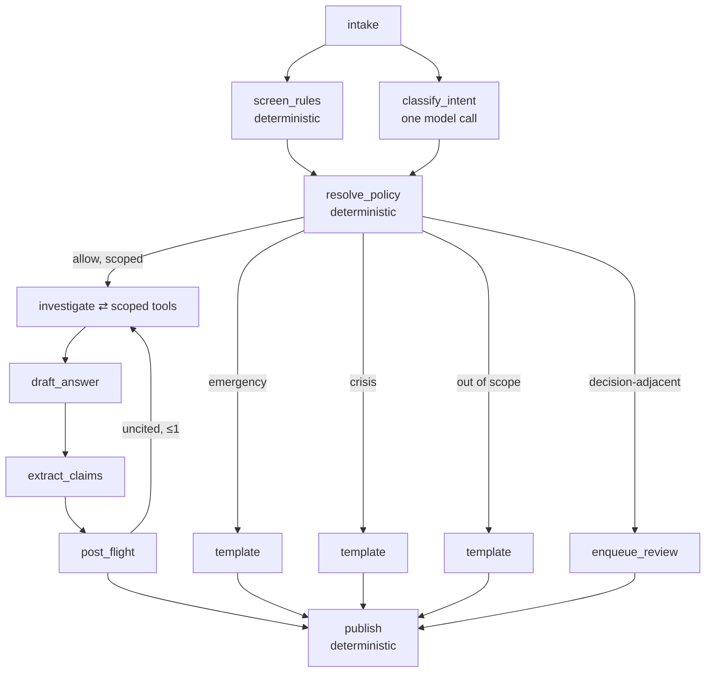

# Architecture overview

!!! info "In one paragraph, for a non-engineer"
    The system is a small state machine. Each box does one job and hands its
    result to the next. Two of the boxes are safety checks — one before the
    assistant reads anything, one after it has written a draft — and the boxes
    that make the final decisions are ordinary code, not the language model.

## The graph

## Five properties this is designed to have

1. **Both halves of the sandwich assess independently.** Pre-flight judges the
   question; post-flight judges the evidence and the answer.
2. **Refusal short-circuits before any patient data is read.** Minimum necessary
   is enforced by topology, not by filtering afterwards.
3. **One model call before any evidence is gathered.** `screen_rules` and
   `resolve_policy` are code. Don't spend a model call on a decision an `if` can
   make.
4. **Cheap checks run before expensive ones.** Critical-value and citation
   checks are pure code and can short-circuit the judge.
5. **Publication is deterministic.** `publish` emits the already-judged draft; it
   contains no model call and cannot alter the text.

## Conventions

- The node filename equals the registered node name equals the trace span name.
- `builder.py` is the only file that wires nodes and edges, so the whole control
  flow reads in one screen.
- Nodes orchestrate, chains compute, agents decide. Each node receives a narrow
  read-only projection of state, not the whole blob.
- Prompts are versioned files referenced by id, never string literals in logic.

Layering is enforced in CI by import-linter:
`api → graph → guardrails → tools → retrieval → store → schemas`.
