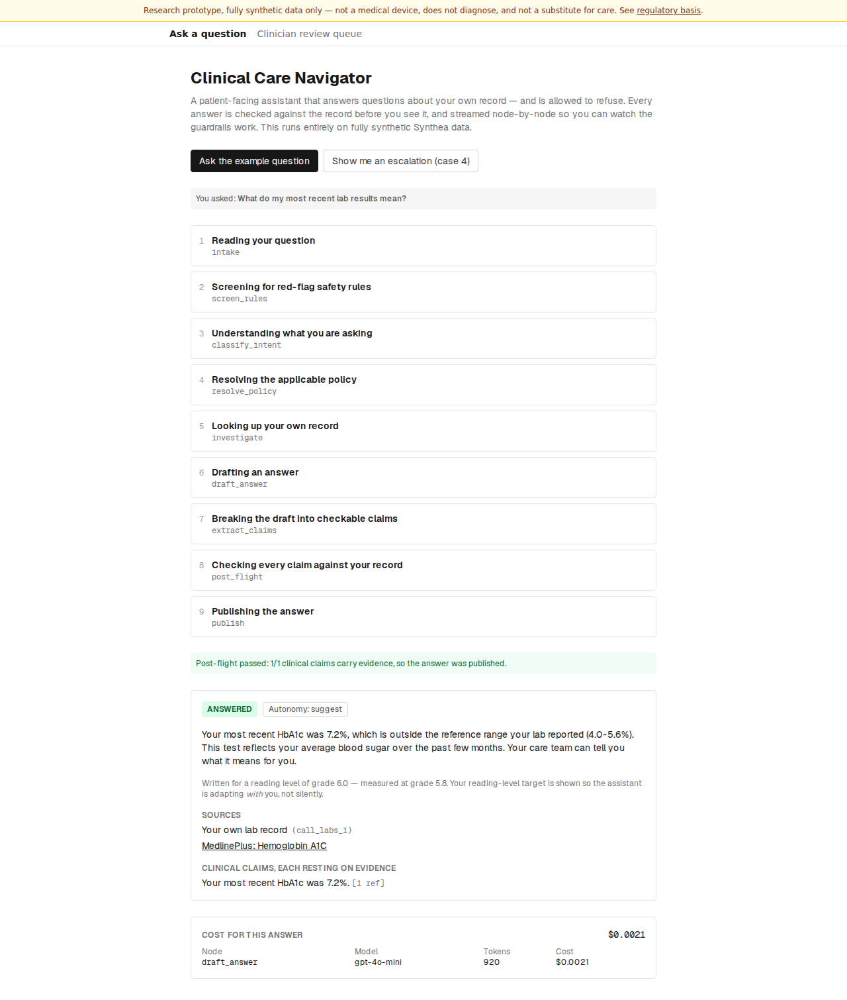
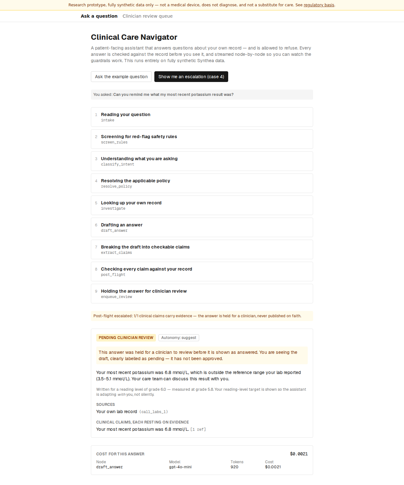
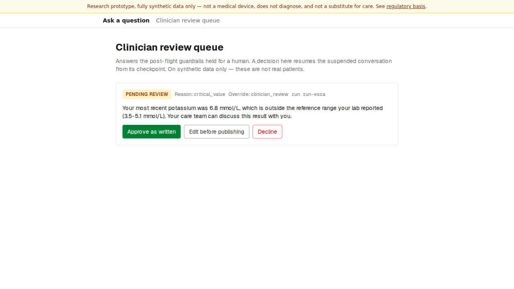

# Watch it work

First paint first: a visitor lands on the app and watches a full answer stream
node-by-node against a preloaded example — before typing anything. The frontend
is a small [Next.js](https://nextjs.org/) app that talks to the same API the
[guardrail sandwich](the-guardrail-sandwich.md) runs behind, and every component
stays local to this repo (an extraction candidate for a shared UI package, logged
in `HARVEST.md`).

Everything below runs on **fully synthetic Synthea data**. The banner saying so
is on every page, and the app is not a medical device.

## A full, cited answer — streamed and checked

The example question runs on load. You see each node as it happens — reading the
question, screening for red-flag rules, resolving policy, looking up *your own*
record, drafting, breaking the draft into claims, checking every claim against
the record, and publishing — then the published answer itself.

Vocabulary discipline reaches the pixel (§3.7):

- A result is **"outside the reference range your lab reported (`x`–`y`)"**,
  never "abnormal".
- The **reading-level target is shown**, so the assistant is adapting *with* the
  reader, not silently.
- Every source is a **clickable link** — the MedlinePlus citation opens the real
  page. A citation nobody can open is not a citation (§6.1).
- The per-node **cost** of the answer is on screen.

## Trigger an escalation — without typing

One click runs **case 4**: a benign-sounding question asked over a critical
value. Pre-flight allows it, but post-flight sees the value itself and escalates.
The trace ends at *Holding the answer for clinician review* instead of
*Publishing*, and the answer is shown clearly labelled **pending** — never as
approved.

The guardrails escalate but never relax a restriction (§5.4): a clean draft over
a dangerous value is still held.

## The clinician review queue

A held answer waits in a reviewer queue. A clinician can approve it as written,
edit it first, or decline — and that decision **resumes the suspended
conversation from its checkpoint** (§5.10).

## How these screenshots stay honest

They are captured by the same Playwright smoke test that verifies the UI, against
the same network mocks (`make docs-screenshots`). A screenshot here therefore
cannot silently drift from what the tested UI actually renders. The smoke test
covers the loading, success, empty, and error states, the case-4 escalation, and
opening a citation.
