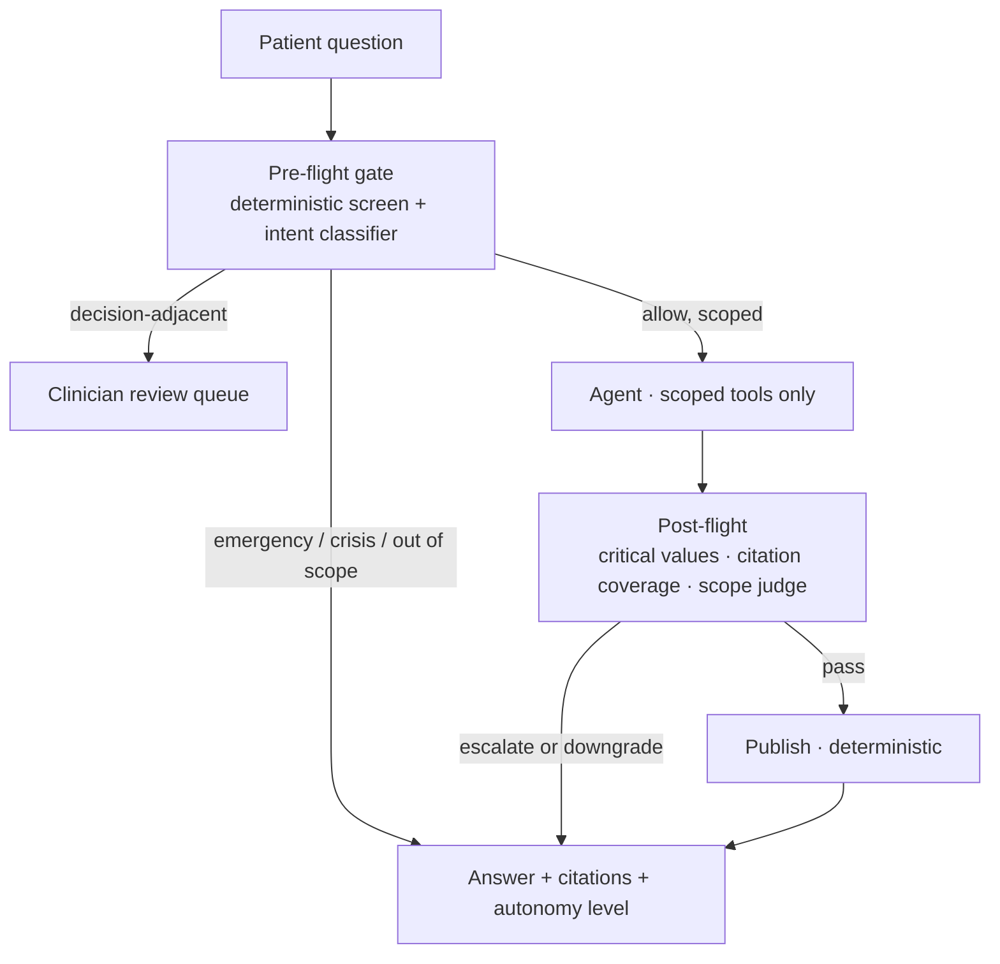

# Clinical Care Navigator

!!! warning "Read this first"
    Architectural demonstration on fully synthetic [Synthea](https://github.com/synthetichealth/synthea)
    data. **Not a medical device. Does not diagnose. Not a substitute for care.**
    Not a screener, a triage tool, or a symptom checker.

**A patient-facing clinical assistant that is allowed to say "I won't answer
that" — and whose refusal is enforced by the architecture, measured in
production, and tunable by the clinical owner rather than the vendor.**

---

## The problem

A patient reads their own portal record and does not understand it. *"My A1c
came back 7.8 — what does that mean?"* An assistant that answers is useful. An
assistant that answers **everything** is a liability, because the same text box
also receives *"should I stop taking my metformin?"*, *"do I have lupus?"*, and
*"I have crushing chest pain."*

Healthcare AI is not blocked by model quality. It is blocked by the absence of
an auditable refusal path.

## What this shows

Policy runs **before** the model and **after** it, and the second half is not a
replay of the first — it assesses the retrieved evidence and the drafted answer
on its own authority. See [The guardrail sandwich](how-it-works/the-guardrail-sandwich.md).

## Status

Phase 0 — template transplant. The walking skeleton streams end to end; the
clinical system is being built on top of it.
